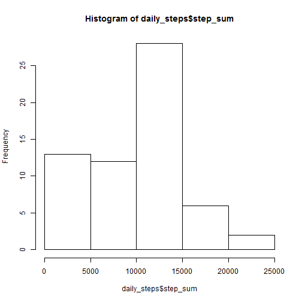
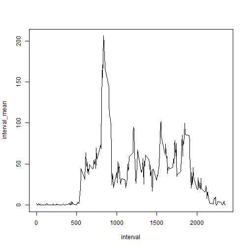
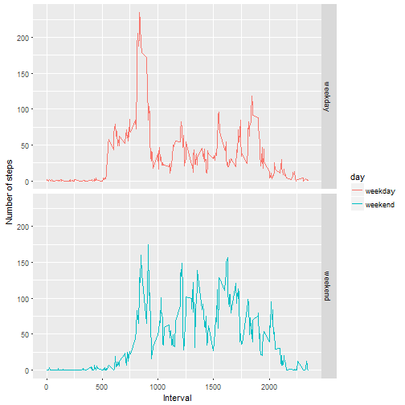

### Load the data

```r
download.file("https://d396qusza40orc.cloudfront.net/repdata%2Fdata%2Factivity.zip", "activity.zip")
unzip("activity.zip", exdir = ".")

library(data.table)
activity <- fread("activity.csv")
```

### Figure out mean total number of steps taken per day

1. Calculate the total number of steps taken per day

```r
library(dplyr)

daily_steps <-
    activity %>% 
    group_by(date) %>% 
    summarise(
        step_sum = sum(steps, na.rm = TRUE),
        interval_sum = sum(interval, na.rm = TRUE))
```

2. Make a histogram of the total number of steps taken each day

```r
hist(daily_steps$step_sum)
```



3. Calculate and report the mean and median of the total number of steps taken per day

```r
mean(daily_steps$step_sum)
```

```
## [1] 9354.23
```

```r
median(daily_steps$step_sum)
```

```
## [1] 10395
```

### Analyse the average daily activity pattern

1. Make a time series plot (i.e. type = "l") of the 5-minute interval (x-axis) and the average number of steps taken, averaged across all days (y-axis)

```r
interval_mean <-
    activity %>%
    group_by(interval) %>%
    summarise(interval_mean = mean(steps, na.rm = TRUE))

with(interval_mean, plot(interval, interval_mean, type = "l"))
```



2. Find out the 5-minute interval that contains the maximum number of steps, on average across all the days in the dataset.

```r
filter(interval_mean, interval_mean == max(interval_mean))$interval
```

```
## [1] 835
```

### Imputing missing values

1. Calculate and report the total number of missing values in the dataset

```r
sum(is.na(activity))
```

```
## [1] 2304
```

2. Fill in all of the missing values in the dataset, with the median for that day.
3. Create a new dataset that is equal to the original dataset but with the missing data filled in.

```r
daily_median <-
    activity %>%
    group_by(date) %>%
    summarise(median = median(steps, na.rm = TRUE))

# If the median of a day is NA, set the value as 0.
daily_median[is.na(daily_median$median),]$median <- 0

activity2 <-
    activity %>%
    merge(daily_median, "date")

activity2[is.na(steps),]$steps <- activity2[is.na(steps),]$median
```

4. Make a histogram of the total number of steps taken each day and Calculate and report the mean and median total number of steps taken per day.

```r
daily_steps2 <-
    activity2 %>% 
    group_by(date) %>% 
    summarise(
        step_sum = sum(steps, na.rm = TRUE),
        interval_sum = sum(interval, na.rm = TRUE))

hist(daily_steps$step_sum)
```


```r
# Seems no impact on the graph with the missing data filled in.
```

### Differences in activity patterns between weekdays and weekends

1. Create a new factor variable in the dataset with two levels � “weekday� and “weekend� indicating whether a given date is a weekday or weekend day.

```r
activity3 <- 
    activity %>%
    mutate(day = ifelse(
        weekdays(as.Date(date)) %in% c("Sunday", "Saturday"),
       "weekend", "weekday"))
```

2. Make a panel plot containing a time series plot (i.e. type = "l") of the 5-minute interval (x-axis) and the average number of steps taken, averaged across all weekday days or weekend days (y-axis).

```r
interval_weekday_mean <-
    activity3 %>%
    group_by(interval, day) %>%
    summarise(interval_mean = mean(steps, na.rm = TRUE))

library(ggplot2)
g <- ggplot(interval_weekday_mean, aes(interval, interval_mean, color=day)) 
g + facet_grid(day ~ .)+ geom_line() + labs(x = "Interval", y = "Number of steps")
```


